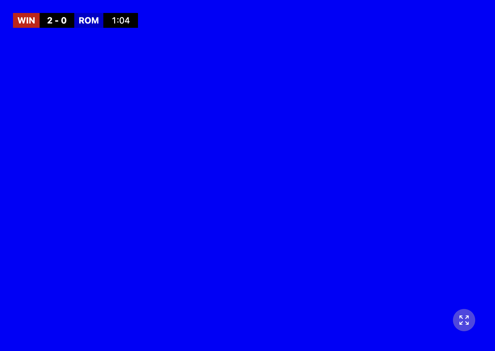
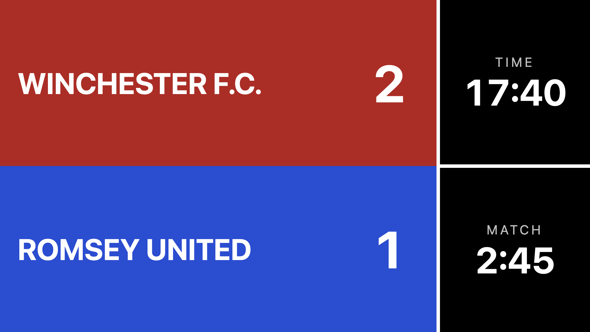
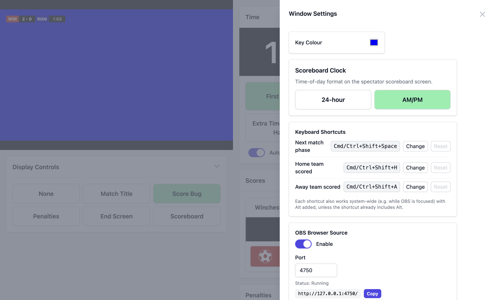

# PlayOverlay

[](https://github.com/JosephMaynard/playoverlay/actions/workflows/ci.yml)

**PlayOverlay** is a free desktop app for adding live score and match-clock graphics to sports video streams, built for streaming community football (soccer) matches to YouTube, and usable for any stream where you key graphics over a live feed.

It renders a broadcast-style score bug, match clock, penalty shootout tracker, and custom graphics on a solid-colour background (blue by default, and you can pick any colour your mixer keys well). Feed that output into a vision mixer or capture device, for example a Blackmagic ATEM Mini, key out the background, and composite it over your camera feed before streaming.



## Spectator scoreboard

Venues can also point a big screen straight at PlayOverlay: the Scoreboard screen fills the display with both teams in their club colours, the score, the time of day, and the match clock, no chroma key, no stream required.



## How it works

PlayOverlay runs two windows:

- **Control window**: the dashboard where the operator updates scores, runs the match clock, tracks penalties, and switches screens.
- **Display window**: a clean, fullscreen output showing the graphics on your chosen key colour. Put this on a second display connected to your mixer (e.g. via HDMI into an ATEM input), then chroma key it over the match feed.

If you're streaming through OBS instead of a hardware mixer, you can skip the second display and chroma key entirely, see [OBS browser source](#obs-browser-source) below.



## Features

- **Score bug** with team abbreviations, optional team logos, live scores, match clock, and stoppage time
- **Match clock** driven by the system clock (no drift over a half), with pause/resume and quick time adjustments
- **Goal log**: every goal is logged with its minute (`23'`, or `45+2'` in stoppage time) and a goal banner goes on air automatically (team and minute, no typing needed). Scorers can be added later, e.g. at half-time, and the end screen lists each team's scorers
- **Undo and redo**: step back through goals, clock and phase changes, screen switches and penalties, without ever rewinding the running clock
- **Crash recovery**: the score, clock, and match state are saved continuously; if the app closes mid-match you can restore where you left off, and the outputs stay blank rather than showing a false 0-0 until you do
- **Match phases**: first/second half with configurable half lengths, and extra time that can be toggled off per match
- **Generic timer mode**: for sports that aren't halves-based, switch the timer to a configurable number of named periods (e.g. 4 × 12-minute quarters)
- **Penalty shootout tracker**: alternates teams automatically, records scored/missed, supports undo, and can be toggled off for matches that don't need it
- **Screens**: match title, score bug, penalties, end screen, plus your own uploaded full-screen graphics and overlay images linked to specific screens
- **Custom key colour** for whatever your mixer keys best
- **OBS browser source output**: an optional local server that serves the display graphics with a transparent background, so OBS users don't need a chroma key at all
- **Phone remote (LAN)**: an optional PIN-gated server that lets a phone on the same wifi control goals, the clock, match phases, and the on-air screen from the touchline
- **Keyboard shortcuts** and **Elgato Stream Deck** support for goals, phase changes, and screen switching
- **Club presets**: save each club's name, abbreviation, colours and logo once, then load any club into the home or away slot for the next fixture
- **Saved match settings**: store whole fixtures and reload them
- **New match**: one button resets the score, clock, penalties, goals and on-air graphics between fixtures, keeping your team settings
- Multi-monitor aware: move the display window between screens, lock windows always-on-top, keep the machine awake while live

## Download

Grab the latest release from the [Releases page](https://github.com/JosephMaynard/playoverlay/releases):

| Platform              | File                             |
| --------------------- | -------------------------------- |
| Windows               | `playoverlay-…Setup.exe`         |
| macOS (Apple Silicon) | `playoverlay-darwin-arm64-….zip` |
| macOS (Intel)         | `playoverlay-darwin-x64-….zip`   |
| Linux (Debian/Ubuntu) | `playoverlay_….deb`              |
| Linux (Fedora/RHEL)   | `playoverlay-….rpm`              |

### A note on unsigned builds

The binaries are **not code-signed or notarized** (signing certificates cost money and this is a free project), so your OS will warn you on first launch:

- **Windows**: SmartScreen may show "Windows protected your PC", click **More info**, then **Run anyway**.
- **macOS**: after unzipping, move `PlayOverlay.app` to Applications. If macOS reports the app is damaged or from an unidentified developer, clear the quarantine flag once from Terminal:

  ```bash
  xattr -cr /Applications/PlayOverlay.app
  ```

If you'd rather not trust an unsigned binary, build it yourself from source, see [Building from source](#building-from-source) below.

## Using it

1. Open **Match Settings** and set team names, abbreviations, colours, and logos, plus the venue, kick-off time, and half lengths. **Save as club** keeps a team's details for next time, and **Load a saved club** fills a team in one step. This is also where you choose between the football timer and generic periods, and toggle extra time and penalties for the match.
2. In **Window Settings**, pick your key colour. Whether screens switch automatically when the clock starts and stops is a toggle next to the clock controls on the dashboard.
3. Move the display window to the output monitor and make it fullscreen.
4. Kick off: start the first half, add goals as they happen, add stoppage time, advance phases. Each goal puts a banner on air automatically and is logged with its minute. At half-time or full-time, open the **Goals** panel to add scorers (the end screen lists them) or show a banner again; the automatic banner can be switched off there too.
5. Between fixtures, **New match** (next to undo and redo) clears the match and puts the match title on air, ready for the next kick-off.

### Keyboard shortcuts

While PlayOverlay is focused, by default:

| Shortcut               | Action           |
| ---------------------- | ---------------- |
| `Cmd/Ctrl+Shift+Space` | Next match phase |
| `Cmd/Ctrl+Shift+H`     | Home team scored |
| `Cmd/Ctrl+Shift+A`     | Away team scored |

The same actions are also available system-wide (they work while OBS or your mixer software is focused) with `Alt` added, e.g. `Cmd/Ctrl+Alt+Shift+H`, unless the shortcut you've bound already includes `Alt`, in which case there's no separate system-wide variant.

These are rebindable: open **System Settings → Keyboard Shortcuts**, click **Change** next to an action, then press the new key combination (a modifier other than Shift is required). Combinations the app already uses, such as `Cmd/Ctrl+Z` and `Cmd/Ctrl+Shift+Z` for undo and redo or `Cmd/Ctrl+C`/`V`/`X`/`A` for editing, are refused. On macOS, `Cmd` and `Ctrl` are recorded as the separate keys you pressed; on Windows and Linux, use `Ctrl` or `Alt` (the Windows/Super key can't be used). **Reset** restores that action's default.

### Stream Deck

Connect an Elgato Stream Deck from **System Settings → Connect to Stream Deck**. The deck shows rotating button sets for scoring, match phases, and screen switching; the logo key cycles between sets. (Uses WebHID, close any other software that's holding the deck, including the official Stream Deck app.)

### OBS browser source

Off by default. If you'd rather not manage a second display and chroma key, PlayOverlay can serve the display graphics directly as an OBS Browser Source, with a transparent background instead of a key colour:

1. Open **System Settings → OBS Browser Source** and switch it on (default port `4750`).
2. In OBS, add a **Browser Source** pointed at the URL shown there (`http://127.0.0.1:<port>/`), sized to your canvas resolution.
3. That's it, no chroma key needed, since the page background is transparent.

The server only listens on `127.0.0.1` (loopback), so it serves OBS running on the same computer as PlayOverlay; other devices on the network can't connect to it, and OBS on a different machine can't use it. It stays off unless you enable it, so nothing changes for anyone who doesn't use it. It updates live over a local WebSocket connection and reconnects automatically if OBS is closed or the app restarts mid-stream.

#### Pinned views

Add `?screen=<name>` to the browser source URL to pin that page to a specific screen, regardless of what the operator currently has selected on the display. This lets you run the normal feed into OBS while a venue TV (or a second OBS scene) shows something else, e.g. the spectator scoreboard, from the same running app, both fed by the same local server. Because the server is loopback-only, a venue TV has to be driven by a browser on the PlayOverlay computer itself (for example a window on a second display).

| `?screen=` value | Shows                          |
| ---------------- | ------------------------------ |
| _(none)_         | Follows the operator (default) |
| `matchTitle`     | Match title screen             |
| `scoreBug`       | Score bug                      |
| `penalties`      | Penalties screen               |
| `endScreen`      | End screen                     |
| `scoreboard`     | Spectator scoreboard           |

**System Settings → OBS Browser Source** shows a ready-made copyable URL for the scoreboard view. Only the built-in screens above can be pinned; `custom` (your uploaded full-screen graphics) and any unrecognised or missing value fall back to following the operator.

## Phone remote (LAN)

Off by default. When you want to run the match from the touchline instead of the laptop, PlayOverlay can serve a small control page to a phone on the same local network (usually the same wifi):

1. Open **System Settings → Phone Remote** and switch it on (default port `3006`).
2. On the phone (connected to the **same local network** as the laptop, usually the same wifi), either scan the QR code shown there or open the URL (`http://<laptop-ip>:<port>/`) in a browser.
3. Enter the 6-digit **PIN** shown in Settings. Once paired, the phone shows the live score, clock, and on-air screen.

From the phone you can:

- Add or remove a goal for either team
- Pause or resume the running clock (**Next phase** starts each half)
- Advance to the next match phase
- Switch which graphic is on air (score bug, match title, scoreboard, penalties, end screen, or blank)

The phone mirrors the live match state, so it stays in sync with the operator and with any other paired phone. Everything it does goes through exactly the same controls as the dashboard, so a phone tap and an on-screen click behave identically.

**Security**: while it's on, the remote server listens on all of the laptop's network interfaces (`0.0.0.0`), so any device that can reach the laptop on your local network can open the page. It isn't exposed to the internet unless the network forwards that port to the laptop (a router port-forward, a DMZ setting, or a laptop with a public IP address), which venue and home networks don't do by default. Pairing is gated by a 6-digit PIN that is regenerated every time you enable the feature, and repeated wrong guesses are rate-limited per device to defeat brute forcing, so a misbehaving device can only lock itself out, never your phone. The server also refuses connections from other web pages, so a page open in a browser on the network can't drive it. It's intended for a trusted venue network, not a hostile public one; leave it off when you don't need it, and treat the PIN like any other password. A paired phone that drops off the wifi reconnects by itself without the PIN. A new PIN is issued whenever you toggle the remote back on or restart the app, so paired phones will need to re-enter it then.

## Languages

The interface and the on-screen graphics are available in English, French, German, Italian, Spanish (Spain and Latin America), and Portuguese (Portugal and Brazil). On first launch PlayOverlay suggests a language based on your system and asks you to confirm it or pick another; if you dismiss the prompt without choosing, it stays unset and asks again next time. You can change the language whenever you like under **System Settings → Language**, and it applies to both the operator dashboard and the on-air graphics. The [phone remote](#phone-remote-lan) control page is in English only for now. Text you type yourself is never translated: team names, abbreviations, venues, and the titles of saved match settings and custom screens are always shown exactly as you enter them.

The translations are **machine-generated and have not been reviewed by native speakers**, so some wording, especially the on-air football terms, may read a little off. If you spot a mistake, please [open an issue](https://github.com/JosephMaynard/playoverlay/issues) and it'll get fixed.

## Updates

On launch the app checks this repository's GitHub Releases for a newer version and shows a notification with a download link. Nothing is downloaded or installed automatically.

## Building from source

Prerequisites: [Node.js](https://nodejs.org) 22.13+ (or 24+) and npm.

```bash
git clone https://github.com/JosephMaynard/playoverlay.git
cd playoverlay
npm install
npm start          # run in development
```

Package distributables for your current platform:

```bash
npm run make
```

Cross-build for Intel from an Apple Silicon Mac (or vice versa):

```bash
npm run make -- --arch=x64    # or --arch=arm64
```

Type-check with `npm run ts-check`, lint with `npm run lint`, run the test
suite with `npm test`, and generate coverage with `npm run test:coverage`.
The CI-only package sanity check is `npm run build:ci`; use `npm run make` to
produce distributables.

Tagged releases (`v*`) are built automatically for Windows, both macOS architectures, and Linux (`.deb` and `.rpm`) by the [release workflow](.github/workflows/release.yml) and attached to a draft GitHub release.

## Privacy and telemetry

PlayOverlay does not include telemetry or crash reporting. The only network request a default build makes is the update check against the public GitHub API.

## Settings storage

Settings are stored with [electron-store](https://github.com/sindresorhus/electron-store) in `config.json`:

- **Windows**: `%APPDATA%/playoverlay`
- **macOS**: `~/Library/Application Support/playoverlay`
- **Linux**: `$XDG_CONFIG_HOME` or `~/.config/playoverlay`

Uploaded images live in an `images` folder alongside it.

## Contributing

Issues and pull requests are welcome. Before opening a PR, please run
`npm run lint`, `npm run ts-check`, and `npm test`, then describe how you tested the change
(this app's job is to not fall over mid-match, so reliability fixes are
especially appreciated).

## Licence

PlayOverlay is open source under the [MIT License](LICENSE): free to use, modify, and redistribute, including commercially.

The **PlayOverlay name, logo, and branding** are owned by Magic Zebra Ltd and are not covered by the MIT licence. A modified or rebranded fork must not present itself as an official PlayOverlay release. See [TRADEMARKS.md](TRADEMARKS.md) for details.
